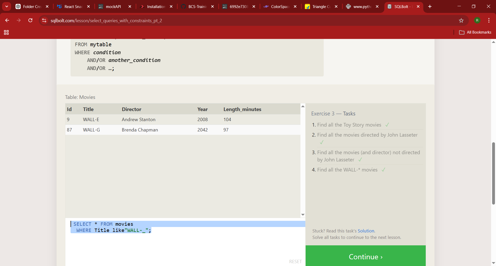
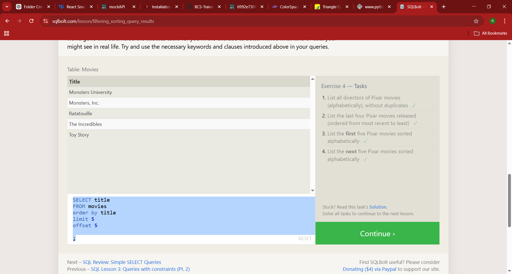
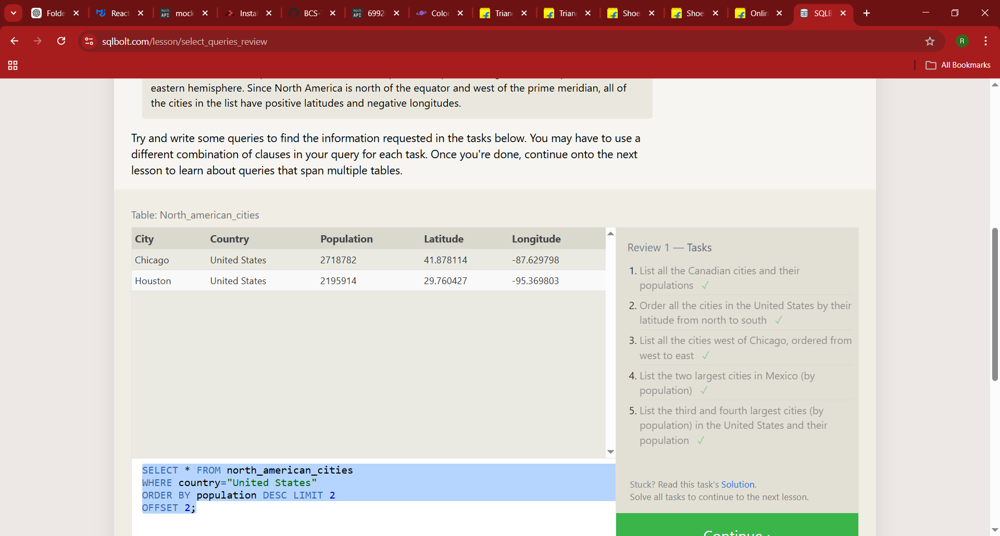
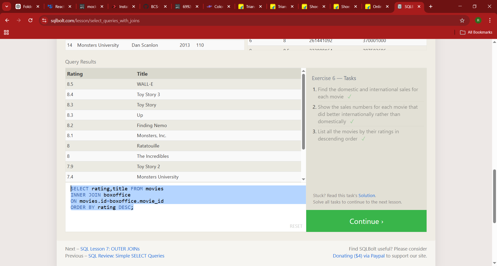
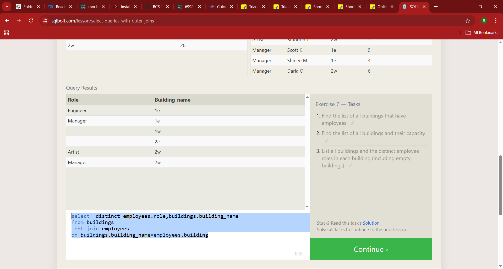
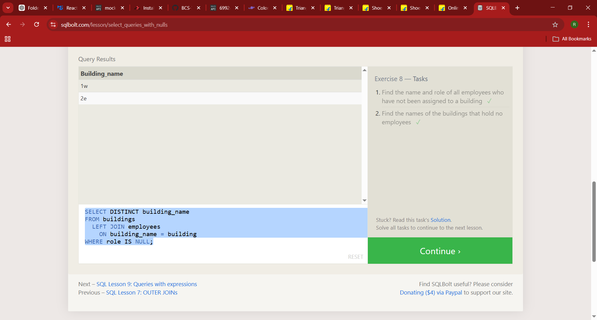
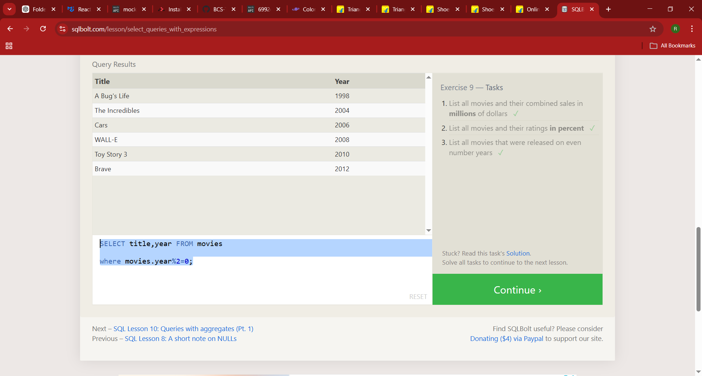
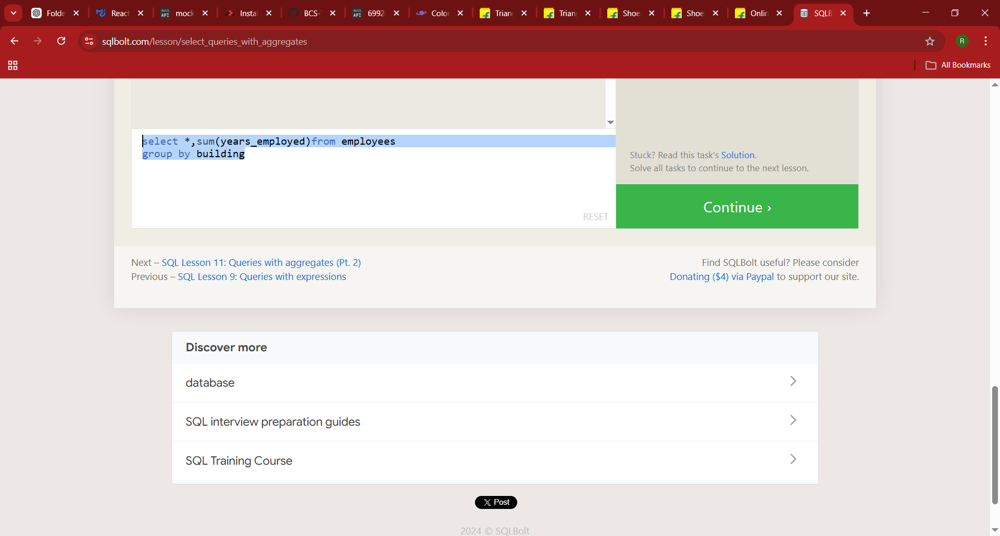
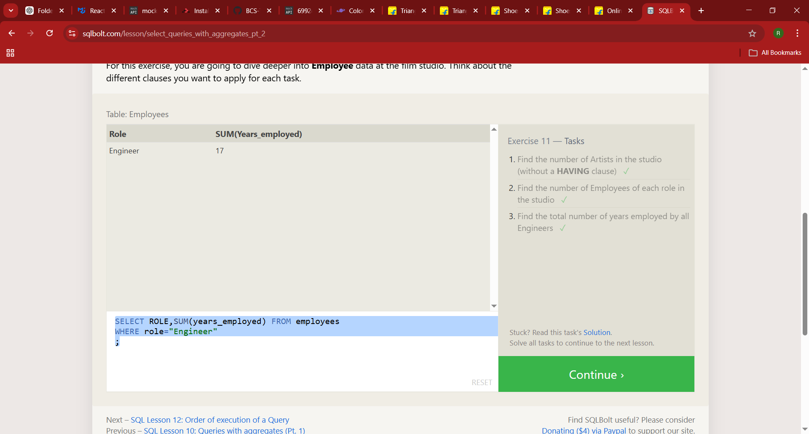
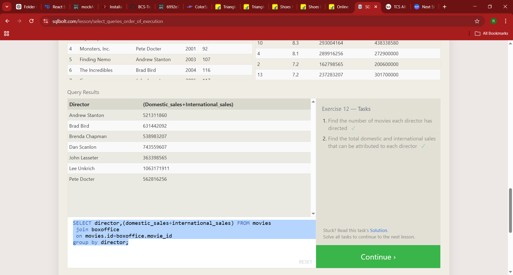

## SQL:

### Task-1:

- Find the title of each film

  ```sql
  SELECT title FROM movies;

  ```

- Find the director of each film

  ```sql
  SELECT director FROM movies;

  ```

- Find the title and director of each film

```sql
  SELECT title,director FROM movies;
```

- Find the title and year of each film

  ```sql
  SELECT title,year FROM movies;

  ```

- Find all the information about each film

```sql
SELECT * FROM movies;
```


### Task-2:

- Find the movie with a row id of 6

  ```sql
  SELECT *
  FROM movies
  WHERE id=6;

  ```

- Find the movies released in the years between 2000 and 2010

```sql
SELECT *
FROM movies
WHERE year between 2000
AND 2010;
```

- Find the movies not released in the years between 2000 and 2010

```sql
 SELECT *
 FROM movies
 WHERE year
 NOT between 2000
 AND 2010;
```

- Find the first 5 Pixar movies and their release year

```sql
SELECT *
FROM movies
WHERE id<6
;
```

 - Google Chrome 2_25_2026 5_10_29 PM.png>)

### Task-3:

- Find all the Toy Story movies

  ```sql
  SELECT * FROM movies
  WHERE Title like "Toy Story%";

  ```

- Find all the movies directed by John Lasseter
  ```sql
  SELECT * FROM movies
  WHERE director = "John Lasseter";
  ```
- Find all the movies (and director) not directed by John Lasseter
- ```sql
   SELECT * FROM movies
   WHERE director != "John Lasseter";
  ```
- Find all the WALL-\* movies
  ```sql
    SELECT * FROM movies
  WHERE Title like"WALL-_";
  ```



### TASK-4:

- List all directors of Pixar movies (alphabetically), without duplicates
  ```sql
  SELECT DISTINCT DIRECTOR
  FROM movies
  ORDER BY DIRECTOR;
  ```
- List the last four Pixar movies released (ordered from most recent to least)
- ```sql
    SELECT title,year
    FROM movies
    order by year DESC
    limit 4
  ;
  ```
- List the first five Pixar movies sorted alphabetically
  ```sql
  SELECT title
  FROM movies
  order by title
  limit 5;
  ```
- List the next five Pixar movies sorted alphabetically
- ```sql
  SELECT title
  FROM movies
  order by title
  limit 5 offset 5;
  ```
  
  ### Task-5:
- List all the Canadian cities and their populations

  ```sql
  SELECT city,population
  FROM north_american_cities
  WHERE Country ="Canada";

  ```

- Order all the cities in the United States by their latitude from north to south
  ```sql
  SELECT city,latitude
  FROM north_american_cities
  WHERE country="United States"
  ORDER BY latitude DESC;
  ```
- List all the cities west of Chicago, ordered from west to east
  ```sql
  SELECT * FROM north_american_cities
  where longitude<-87.629798
  order by longitude ;
  ```
- List the two largest cities in Mexico (by population)

```sql
SELECT * FROM north_american_cities
WHERE country="Mexico"
ORDER BY population DESC LIMIT 2;
```

- List the third and fourth largest cities (by population) in the United States and their population
  ```sql
  SELECT * FROM north_american_cities
  WHERE country="United States"
  ORDER BY population DESC LIMIT 2
  OFFSET 2;
  ```
  

Half data gets updated and the other half doesnt get updated means then it is said to be -_- UPDATE ANAMOLY(Inconsistent Data)-_

- One big table is said to be Denormalize table.
- The separate separate table is said to be Normalized table.
- The connected middle table is said to be Association table or Mapping Table.

FIRST NORMAL FORM RULE:

- One column should contain only one information.
- Avoid mixed datatype.
- primary key should not be null and it should be unique.
- Repeating groups are not allowed.

  SECOND NORMAL FORM RULE:

- Each non-key must depend on the primary key.

  THIRD NORMAL FORM RULE:

- Non-key attribute doesnt depend to another non-key attribute.
- It must be depend only to the key-attribute.

### **_PRIMARY KEY RULES_**:

- Primary should be unique.
- Primary should not be null.
- Each table should have only one primary key.

### Having:

- After group by we need to filter means we use**\_ **Having\_\*\* clause.
- Before group by we need to filter means we use **_ Where_** clause.

- ## JOIN:
- "_* INNER JOIN*_"-->acts as a intersection and gives the common things.

X-BOX LIVE service is used to play online games without install it and we rent it in cloud by paying money.

## DATABASE:

- It is a software to store data in a organized manner.
- Features:
- frequently asked it will have it in the ram.
- Querying becomes easier.
- CRUD becomes easier.
- Backups are inbuilt.
- UNDO-easily(time limit)
- performance.
- SQL-Structured Query Language (It is also called as Relational Database)-->postgrese
- PL SQL is the database of Oracle.
- NO Sql- mongo db,redis,cassandra,dynamo db,couch db,neo4j.

- RAM is 10 thousand times faster than the hard disk drive.
- SSD is 10 times faster than the hard disk drive.
- Hard disk permanently store the data.
- RAM will temporarly store the data.
- when we getting a loading page means the hard disk copy the data to the RAM .
  ### Cloud:
  - Renting PC.
  - Cloud OS- Alphine(one of the linux)
  - Advantage of cloud:
  - Disaster and Scaling.
  -

## Exercise 6 — Tasks:

- Find the domestic and international sales for each movie ✓
  ```sql
  SELECT * FROM movies
  INNER JOIN boxoffice
  ON movies.id=boxoffice.movie_id;
  ```
- Show the sales numbers for each movie that did better internationally rather than - domestically

```sql
SELECT * FROM movies
INNER JOIN boxoffice
ON movies.id=boxoffice.movie_id
WHERE boxoffice.domestic_sales < boxoffice.international_sales;
```

- List all the movies by their ratings in descending order
  ```sql
  SELECT rating,title FROM movies
  INNER JOIN boxoffice
  ON movies.id=boxoffice.movie_id
  ORDER BY rating DESC;
  
  ```

## Exercise 7 — Tasks:

- Find the list of all buildings that have employees
  ```sql
  SELECT distinct building
  FROM employees;
  ```
- Find the list of all buildings and their capacity

```sql
SELECT * FROM buildings;
```

- List all buildings and the distinct employee roles in each building (including empty buildings)
- ```sql
  select  distinct employees.role,buildings.building_name
  from buildings
  left join employees
  on buildings.building_name=employees.building
  ```

  

  ## Exercise 8 — Tasks:

- Find the name and role of all employees who have not been assigned to a building
  ```sql
  SELECT name,role,building FROM employees
  limit 2 offset 13;
  ```
- Find the names of the buildings that hold no employees
  ```sql
  SELECT DISTINCT building_name
  FROM buildings
  LEFT JOIN employees
  ON building_name = building
  WHERE role IS NULL;
  ```
  

### Exercise 9 — Tasks:

- List all movies and their combined sales in millions of dollars
  ```sql
  SELECT title,(domestic_sales + international_sales)/1000000 FROM boxoffice
  left join movies
  where movies.id=boxoffice.movie_id;
  ```
- List all movies and their ratings in percent
  ```sql
  SELECT title,rating*10 FROM boxoffice
  left join movies
  where movies.id=boxoffice.movie_id;
  ```
- List all movies that were released on even number years
  ```sql
  SELECT title,year FROM movies
  where movies.year%2=0;
  ```
  

## Exercise 10 — Tasks:

- Find the longest time that an employee has been at the studio
  ```sql
  SELECT* FROM employees
  ORDER BY years_employed DESC
  LIMIT 1;
  ```
- For each role, find the average number of years employed by employees in that role
  ```sql
  SELECT *,avg(years_employed)FROM employees
  group by role;
  ```
- Find the total number of employee years worked in each building
  ```sql
  SELECT *,SUM(years_employed)FROM employees
  group by building
  ```
  

### Exercise 11 — Tasks:

- Find the number of Artists in the studio (without a HAVING clause)
  ```sql
  SELECT sum(role="Artist") FROM employees;
  ```
- Find the number of Employees of each role in the studio
  ```SQL
  SELECT ROLE,COUNT(role) FROM employees
  GROUP BY role;
  ```
- Find the total number of years employed by all Engineers
  ```sql
  SELECT ROLE,SUM(years_employed) FROM employees
  WHERE role="Engineer";
  ```
  

### Exercise 12 — Tasks:

- Find the number of movies each director has directed
  ```sql
  SELECT director,COUNT(title) FROM movies
  GROUP BY director;
  ```
- Find the total domestic and international sales that can be attributed to each director

```sql
SELECT director,(domestic_sales+international_sales) FROM movies
join boxoffice
on movies.id=boxoffice.movie_id
group by director;
```


